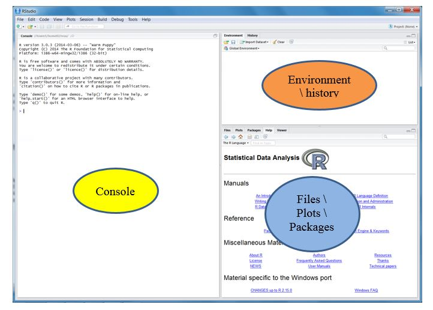
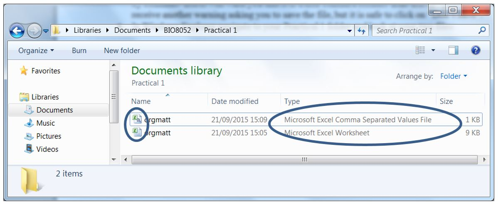

```{r setup, include=FALSE}
knitr::opts_chunk$set(echo = TRUE)
knitr::opts_chunk$set(fig.width=3, fig.height=3)
rm(list=ls())
```

## Introduction
Systematic literature reviews, followed by meta-analysis before making informed
decisions, has been standard practice in the medical sciences for many years,
but is relatively little used in ecology and conservation. A systematic 
literature review uses formally-defined search criteria of the published
scientific literature, so that the results of the literature search are
reproducible, in the same way that a laboratory or field-experiment should
have a formally-defined methodology such that other scientists can obtain the
same results. Meta-analysis uses data from already-published papers to gain
additional power and insights, that would not be possible from analysis of the
data from a single paper.

In this module you will learn about best practice for planning and performing a
systematic review, undertake some basic meta-analyses on published data, and 
write a report based on your findings to guide policy-makers. Most of the 
analyses will be via the R package, which many of you may not have used before,
therefore the first few practicals a simply to introduce to the R (using the
RStudio interface), data input / output, summaries, simple statistics, and
graphical output.

## Aims of Practical
* Introduce you to the R statistics package and RStudio environment
* Learn how to import and export data from Excel to R
* Summarise and reshape data
* Simple plots of continuous and categorical data

## What is R?
R is the most widely used statistics package both in academia, and also amongst environmental scientists and ecologists.  One reason for its popularity is that it is both a statistics package and a computer programming environment.  This allows anyone to write an add-on 'package' to provide new functions for R; indeed there are many packages that are now available specifically aimed for use by ecologists.  One disadvantage of R is that compared to 'point-and-click' menu-driven programs (such as Minitab, SPSS or SAS), it has a steep initial learning curve.  However, once you have learnt the basics, the structure of many analyses are relatively simple, and it is also much easier to document analyses using "R Scripts" compared to menu-driven software, and reproduce analyses consistently.

## Interactive website
I have created an interactive website to help people use RStudio for the first time, which you might find useful to read before attempting this practical. You can access via Canvas or [through this link](https://naturalandenvironmentalscience.shinyapps.io/RstudioInstall/#section-navigating-r-studio). Note: some of the material on the website refers to another module, BIO2020, but most is relevant to BIO8075 and is relevant.

## Getting Started with R and RStudio
R is open source software, freely available to download from the main website so you can install it on your own PC (it runs on Windows, Macs and Linux):

https://www.r-project.org/

RStudio is an integrated development environment (IDE) that makes it easier to manage your data analyses.  It comes in several versions, and RStudio Desktop it is also freely available for personal use:

https://www.rstudio.com/products/rstudio/download/

Until you are experienced in using R/RStudio you are strongly recommended to use the version of R installed on the NUIT cluster-room PCs.

## Starting RStudio
After you start R you should see the following screen:



There are 3 parts to the screen:

* Console (left)
    + this is where you can type R commands to read in data, and display results of analyses.
* Environment \ History tabs (top-right): 
    + Environment: displays a list of data objects in temporary memory in your RStudio session
    + History: stores a record of all the R commands you have issued in the current session
* Files \ Plots \ Packages \ Help \ Viewer tabs (bottom-right):
    + Files:  Lists files and folders that RStudio uses in its current 'Working Directory'
    + Plots: Any graphs you produce are stored here and can be exported to Word etc.
    + Packages: List of packages you have installed etc.
    + Help: The help for R commands
    + Viewer: Create Powerpoint-like presentations (we will not use this feature).

The most important area, and the one you will use primarily in this first practical, is the **Console**, but you will use some features from other tabs today also.


## Working Directory or Folder
RStudio needs to know where to look to find data, or where to export data.  It is best to create a folder for any particular analysis, and store R-scripts, data-files, results etc in that folder.  So before you begin your analyses, create a folder BIO8075 in your Documents Filespace and within that folder create a subfolder called Practical 1 

**Session -> Set Working Directory -> Choose Directory...**

Navigate to the Practical 1 folder you have just created, and click on the **"Select folder"** button. **Note** RStudio also allows you to create "projects" which are special files that when opened automatically tell R what is the working folder. Ask if you want to know more about this feature, or look at [this section of the interactive website](https://naturalandenvironmentalscience.shinyapps.io/RstudioInstall/#section-projects)


## The Basics
### Using R as a calculator
Although R looks intimidating at first, you can use it like a giant calculator, by typing commands straight into the Console at the > prompt sign:

```{r basics }
2*4
3+20
log10(1000)
log(1000)
pi
```

You can see that R can readily be used as a calculator, and that there are built-in functions such as log10() and stored constants such as `pi` for $\pi$ . Note also that `log()` uses natural logarithms, whilst `log10()` is needed for logarithms to base 10.  R also has logical operators, for example `<` represents "is 7 less than 10?"

```{r logical}
7 < 10
```
You can use the following symbols: `==` (are two things equal?), `!=` (are they not equal), `>` (greater than?), `<` (less than?), `>=` (greater than or equal to?), `<=` (less than or equal to?).  These logical operators can be combined to allow advanced sub-setting of large amounts of data.

## Functions, storing values within R
So far all your calculations have produced a single number.  You might want to create a series of numbers, e.g. 1 to 10.  This is easy with the colon operator:

```{r}
1:10
```

Of course often you might want something more complicated.  Suppose you have soil cores, at 2.5 metres apart:

```{r}
seq(from=0, to=20, by=2.5)
```

The sequence function, seq, takes three arguments, the from and end points, and the step interval.  Try repeating the above command again, but set the 'to' value to 70 or 100.  Question: What does the number in square brackets at the start of the line represent?

If you want to save your sequence of numbers for later use, you can assign them to an R object:

```{r soils1}
soil_cores <- seq(from=0, to=20, by=2.5)
```

The assignment operator `<-` puts the results into an R object called `soil_cores`.  If you look in the _Environment_ window at the top right of RStudio you will see it has appeared.  To print it out, simply enter its name:

```{r soils2}
soil_cores
```

You can nest functions inside each other.  To list all the R objects you can use the ls() function, whilst to remove an object use the rm() function.  **Question:** What do you think the following will do and why?

`rm(list=ls())`

## R Scripts
A great advantage of R over traditional menu-driven statistics packages is the use of R Scripts.  These are plain text files containing all the commands you want to execute.  To create a script type click on:

**File -> New File -> R Script**

and a blank R Script file should appear at the top left of RStudio.  Scripts provide a secure, reproducible, annotated method of data analysis.  Let's create a script:

```{r script, eval=FALSE}
# Your name
# 13 November 2017
# This is to demonstrate basic use of scripts

# Begin by clearing the R working area
rm(list=ls())

# Simple calculations
2 + 7
log(100)  # This is natural log

# Some vectors
x <- seq(1, 10, 0.5)  # Entering from, to, by is optional
y <- seq(101, 110, 0.5)
x + y
```


**Key points**

* Anything after a hash # sign is ignored.  Use them to comment your script so you understand what you did and why
* The script only contains instructions for R, it does not contain output
* You may have spotted RStudio automatically closing brackets or giving hints as you typed
* Use blank lines to help structure your script
* The last command x + y acts on all the numbers in your vector at once

The current name of the R Script at the top is 'untitled1' and it is in red to show it has not been saved.  Before going further, save your script:

**File -> Save**

give it a sensible name (without spaces), and save it in your Practical 1 folder.  To run the script (i.e. send its contents to the Console), click on a line in the script and press CTRL-Return keys simulatenously.

## R packages
R has many 'add-on' packages that greatly extend its capabilities.  In this module and in NES8010 we are going to make use of the 'tidyverse' package, which is a group of packages (or meta-package) providing facilities for advanced plotting of data (`ggplot2`), data manipulation (`tidyr`) etc.

### "Goal oriented" approaches
I also like the `mosaic` package which makes it easier to plot basic graphs using `ggplot2` as it has a consistent "goal-oriented" focus to both analyses and display of data. By a "goal-oriented" approach I mean:

$$\textit{goal}(\textit{response ~ explanatory, data = dataset_name, ...})$$

where:

* $goal$ could be a scatterplot, boxplot, simple statistic like a mean or standard deviation, or a linear model for a regression or analysis of variance
* $response$ this is what is conventionally is plotted on the vertical y-axis of a graph. It is the **outcome** you expect to change as a result of some **intervention** (think back to PICO). e.g. are the numbers of species of insects greater on organic vs conventional farms? Your response is the number of species of insects
* $explanatory$ This is your intervention. This might be an experimental "treatment" but in biodiversity,  conservation or agricultural studies you might be comparing sites with different management regimes for example. Your explanatory might be categorical (like farm management) or continuous (e.g. elevation)
* $\textit{dataset_name}$ This is the name of the table of data that contains your response and explanatory variables
* $...$ You may want to include additional options, e.g. to control colours on a graph


### Installing packages
To install the `tidyverse` package type:

`install.packages("tidyverse")`

as it is a big collection of packages it may take a while to install.  Once installed you can activate it with the library function (don't worry about warning messages). The `mosaic` package should already be available on the NUIT cluster PCs, but if not, you will also need to install it. Activate both packages with the `library` function - when you activate a package you make its additional functionality and features available for you to use:

```{r, warning=FALSE, message=FALSE}
library(tidyverse)
library(mosaic)
```

## Data import from Excel
R does not have a built-in spreadsheet, so you will usually find it easiest to enter your data in Excel, export it from Excel in comma-separated values (CSV) or other text format, then import it into R.  From the Blackboard website, right-click on the file orgmatt.xlsx, select 'Save link as...' and save it in your Practical 1 folder.

Open the file using Excel.  **Note data format:** it is from a simple experiment with one response variable and one explanatory listed in two columns.  The data are from a study of soil organic matter content at two different sites.  The explanatory variable 'site' contains two levels representing your two different sites, A and B.

* Now use the __File-Save As menu__ in Excel to save the data in your filespace, saving it as filetype __CSV (Comma delimited)(.csv)__.  This is a plain text, with the columns separated by commas.  Excel will warn you that it is a non-standard format.  Exit Excel - you will receive another warning asking you to save the file, but it is safe to click on "Don't Save" (Microsoft gets upset if you do not use its proprietary file formats!).
* In Windows Explorer navigate to your Practical 1 folder and look at your two files:



If you have the standard Windows settings which hides the filename "extension" both files will appear to have the same name.  If your Windows Explorer is set to show all file titles, the clue that they are different is in the "Type" column, which distinguishes between the original and comma-separated files.  If your Windows Explorer only shows the icons and filenames, the icon beside the names differs.  If you want Windows to display the full filename please ask myself or a demonstrator.

Now import the data into RStudio using the read_csv function, typing the command at the > prompt symbol in the Console window.  This needs to know the name of your file in quotes, and hit the large "Return" key to enter the command at the end:

```{r import_orgmatt}
orgmatt.dat <- read_csv("orgmatt.csv")
```

The `<-` sign is an "assignment"" sign, to assign the data you have read into an R table of data called orgmatt.dat You will see R reading in the file into a "tibble" which is a table of data or "data.frame".  

R stores data, results of analyses etc. in a 'workspace'.  You can store your data inside R under any name but I find like to indicate that this is the raw data by putting a short code at the end of the name to indicate what it contains, in this case ".dat"" to show this is data.  If you click on the Environment tab at the top-right of your RStudio screen you will see orgmatt.dat listed in your workspace, with an indication of the number of rows and columns:


If you double-click on the name you will see the data displayed in a spreadsheet-like viewer, but you cannot edit it unless you are running RStudio version 0.99 or above.  You can also view it in the Console:

```{r display_orgmatt}
orgmatt.dat
```

__Note:__ you may notice many books about R using the `read.csv` (base R) command rather than `read_csv` (from `tidyverse` package).  The latter is more advanced, and recommended for this module, but you can use either.

## Summary statistics about your data
Use the `summary` command to find mean (average), median, min, max etc. of your data:

```{r summary original orgmatt}
summary(orgmatt.dat)
```

Notice how your explanatory, site, variable is summarised differently to the response, as it is categorical 

To display just the site variable, use the `select` function and give the name of the variable:

```{r select example}
select(orgmatt.dat, site)
```

which will display the second column of data.  To display rows 5 to 10, use the slice function, specifying which rows you want

```{r slice example, warning=FALSE}
slice(orgmatt.dat, 5:10)
```

Suppose you want to calculate the average organic matter, and standard deviation, for each site.  This is easy to do using the summarise and group_by functions, and also a "pipe" symbol %>% which means "THEN" send data or the output of one function into another function:

```{r group_by and summarise example, warning=FALSE, message=FALSE}
orgmatt.dat %>%
   group_by(site) %>%
      summarise(mean_orgmatt = mean(orgmatt))
```

The above few lines may look a little challenging at first, but simply say "take the orgmatt.dat data, group it according to site code, calculate the average for each site".  __Question:__ Modify the above code so that it calculates a mean, sd and maximum value in one output. ( __Hint:__ use the up-arrow to save you having to re-type the whole command, or enter it into your R Script window).

 You can do the equivalent using the "goal-oriented" approach of `mosaic` using:

```{r means_by_mosaic}
mean(orgmatt ~ site, data=orgmatt.dat)
```

Personally I think this is easier, as it only needs one line of code, and sticks to a "response ~ explanatory" format quite clearly.

Should you wish to store the results of a `group_by` and `summarise` command for later use, simply assign the output to a new R object:

```{r group_by and summarise saving results, message=FALSE}
org_means <- orgmatt.dat %>%
   group_by(site) %>%
      summarise(mean_orgmatt = mean(orgmatt))
```
The above lines do not display anything, but simply store the results in `org_means`.
To display the contents of `org_means` simply type its name in the Console window.
Finally, can you modify the above three lines to create a tibble or data.frame that
contains _both_ the mean and standard deviations of the data? **Hint**: you need to call both the `mean` and `sd` functions within the `summarise` function


## Plotting your data
In this NES8010 you are mainly going to use one of the 'tidyverse' packages, `ggplot2`, to undertake plotting.  Although it is harder to learn than standard base plots, it gives you much more control over appearance, layout etc. I'll also show you how to use `mosaic` which gives access to `ggformula`. This gives a more accessible interface to `ggplot2` which is challenging to learn initially. You can read more about `ggformula` [at this website](https://cran.r-project.org/web/packages/ggformula/vignettes/ggformula-blog.html). Again, it is usually best to store the code for your plots in your R Script file; that means you can regenerate them exactly whenever you need, even if your original data change.

### Boxplots
You may be familiar with bar-charts, but many scientists argue these hide too much information.  A common alternative are boxplots.  We build a plot in several steps, layer-by-layer, adding new layers with a plus `+` symbol.  We begin with a call to the `ggplot` function, the name of the table of data, and the "aesthetics", i.e. what will be on the x and y-axes.  Enter the following into your R script, and run it in the usual way with CTRL-Return:

```{r ggplot blank canvas}
ggplot(orgmatt.dat, aes(x = site, y = orgmatt) )
```

Hmm. not very good is it!!  It will display a blank plot, with x and y axes labelled, but no data.  We have to add a geometry layer, in this case to say we want a boxplot.  We put a `+` at the end of the first line, then add the boxplot layer using the geom_boxplot function.  Since geom_boxplot is a function, there are round brackets after it:

```{r ggplot add boxplot}
ggplot(orgmatt.dat, aes(x = site, y = orgmatt) ) +
   geom_boxplot()
```

This is much better, but the axis labels are not very good.  This is easy to correct with xlab and ylab (remember to add the `+` symbols at the end of the line):
   
```{r ggplot xlab ylab}
ggplot(orgmatt.dat, aes(x = site, y = orgmatt) ) +
   geom_boxplot() +
   xlab("Study area") +
   ylab("Organic matter content")
```

If, like me, you're not particularly keen on the default colours with the grey background, you can set it to a classic appearance by changing the theme:

```{r ggplot theme}
ggplot(orgmatt.dat, aes(x = site, y = orgmatt) ) +
   geom_boxplot() +
   xlab("Study area") +
   ylab("Organic matter content") +
   theme_bw()
```

There are several different themes (some used by UK national newspapers or scientific journals) available in ggplot.  I often use `theme_bw()` and especially `theme_classic()`
   
Useful tip: click on the "Export" button on a graph and you can copy it to your clipboard, save as a pdf file etc. to insert into Word reports or Powerpoint presentations.

### The same boxplot with `ggformula` approach
If, like me, you sometimes find `ggplot2` a challenge, you can alternatively use the `mosaic`/`ggformula` approach. This also allows you to link graphics functions together, but uses the "pipe" or THEN `%>%` symbol.

First, the basic boxplot. Note how we use a "goal-oriented" approach, so here your "goal" is to produce a boxplot, the "response" vertical axis is `orgmatt` and the explanatory is `site`:

```{r}
gf_boxplot(orgmatt ~ site, data=orgmatt.dat)
```

Just as before, you can now tweak your code to create the identical graph:

```{r complete_boxplot_with_ggformula}
gf_boxplot(orgmatt ~ site, data=orgmatt.dat) %>% 
   gf_labs(x="Study area", y="Organic matter content") %>% 
   gf_refine(theme_bw())
```

You can see that the `gf_` ("graphics formula") approach is slightly shorter, with only 3 compared to 5 lines of code, and to my mind is slightly easier to learn. However, it is entirely optional which method you use to plot graphs.

## Reshaping data
Sometimes you will be sent data that are not in the best format to analyse using R and you will need to restructure the data.  The following data are from an experiment to determine the impacts of different cutting regimes (Low, Medium or High) on insect diversity.  The data show the diversity of insects caught in each of the five plots per treatment:

|cuttingL | cuttingM | cuttingH|
|--------:|---------:|--------:|
|60|64|87|
|57|67|84|
|67|74|69|
|58|63|85|
|61|70|85|

Start Excel and enter the data as shown above, then use **Save As** in Excel to save into a **CSV format** file called `grassland.csv`.  As before, make sure you have saved it in the correct Folder so that R knows where to find the file, before using the `read_csv` command:

```{r read insect data}
insect.dat <- read_csv("grassland.csv")
insect.dat
```

Most univariate analyses in R (and many other statistical packages) expect the **response** and **explanatory** variables to be in different columns; here we need two columns, one to contain the response (insect diversity), and a second to contain the explanatory (cutting regime).  Your `insect.dat` data are in 'wide format' and we need to convert it into a 'tidy' or 'long' format. The `gather` command can be used, but this is now being replaced with the newer `pivot_longer` which is slightly easier to understand:

```{r gather insect data}
# Conventional method in most books
insect.tidy <- gather(insect.dat, key="treatment",    
                      value = "diversity")
# Newer method
insect.tidy <- pivot_longer(insect.dat, cols = c("cuttingL", "cuttingM", "cuttingH"), 
                            names_to = "treatment",
                            values_to = "diversity")
insect.tidy
```

Your response and explanatory data are now in two columns, and this type of data is often called 'tidy data' or 'long data' as it is usually easier to analyse and plot. You can turn data from 'long' format into 'wide' format using the reverse functions `spread` and the newer `pivot_wider` do the opposite.

__On your own:__

* Produce summary statistics (mean, sd) for your insect.tidy data (Hint: use the `group_by`, `summarise` and `%>%` functions.)
* Produce a boxplot of your insect diversity data (Hint: build up your boxplot in `ggplot` or `gg_formula` layer-by-layer in your R Script as you did earlier).

## Factors
Notice that the diversity seems to be higher where the cutting is higher, but there are outliers in the data.  Unfortunately your boxplot does not have the three treatments in a logical order; it has put the High cut first, the Low second, and the Medium third.  This is because by default it takes them in alphabetical order.  To correct this, we need to change the character into a factor, and reset the order using the `factor()` function, and also ensure that the `levels` are plotted Low, Medium and High in your boxplot.  Issue the following commands:

```{r insect summary convert to factors}
summary(insect.tidy)

insect.tidy$treatment <- factor(insect.tidy$treatment,
                         levels=c("cuttingL", "cuttingM", "cuttingH") )

summary(insect.tidy)

```

__Note__

1.	The original `summary()` showed the treatment as a 'character' but after converting it to a factor it shows the number of 'levels' for Low, Medium and High
2.	the `$` operator is used to run commands on just a single column, here treatment
3.	the levels option allows you to specify the order of your levels.  The small `c` is to indicate that there are multiple items of text to follow in the brackets.

Re-run `ggplot` or `ggformula` code to produce your boxplot; you will now see that the order of the three treatments is more logical.  In general, after reading your data into R using `read_csv` you may want to convert character variables to factors if they represent experimental treatments (leave them as characters otherwise).


## Continuous data
In this section we look at an example where your explanatory data are continuous, and summarise \ plot the data.  Download the file `bluetit.csv` from Blackboard; it shows the breeding condition of blue tits in early spring relative to the amount of bird food made available in suburban gardens over winter.

```{r read bluetit data}
bluetit.dat <- read_csv("bluetit.csv")
summary(bluetit.dat)
```
Notice how R displays min, mean, max values etc. for your explanatory variable (gardenfood) as this is a __continuous__ explanatory variable, unlike your organic matter and insect diversity studies which had __categorical__ explanatory variables. 

You now want a scatter-plot to display the data
### Scatterplot of bluetit data with `ggplot2`

```{r ggplot bluetit scatter}
ggplot(bluetit.dat, aes(x=gardenfood, y=condition)) +
    geom_point() +
    theme_bw()
```

You can see that there is a general trend of increased bird condition with the provision of garden food, although the data are noiser at the upper end of the scale.  We can overlay the line of best fit from a linear model (lm) with ggplot:

```{r ggplot bluetit scatter plus lm, message=FALSE}
ggplot(bluetit.dat, aes(x=gardenfood, y=condition)) +
    geom_point() +
    geom_smooth(method = 'lm', se=TRUE) +
    theme_bw()
```

This graph shows a fitted straight line regression (fitted by a 'linear model' or 'lm') and the standard error of the fitted line.

__Warning:__ This is very nice as a short-cut to visualise your data with a simple straight line, but it does not provide you with model statistics, nor work for complex models.  These have to be fitted manually.

You can improve your plot using `xlab`, `ylab` as earlier.

### Scatterplot of bluetit data using `ggformula`
Here is the identical plot with the `ggformula` approach if you prefer it, using the `gf_point()` function:

```{r bluetit_ggformula}
gf_point(condition ~ gardenfood, data=bluetit.dat) %>% 
   gf_smooth(method="lm", se=TRUE) %>% 
   gf_refine(theme_bw())
```

Use `gf_labs()` if you want to change the x and y axis labels.


## Simple summary statistics
### Function for standard error
It is easy to obtain most of the standard summary statistics that you might need.  Note that R does not have a built-in command for se (standard error), so we will create our own.  Recall that standard error is simply the square root of the variance divided by the number of values.  It gives a measure of any bias in your estimate of the mean:

$$s.e.=\sqrt{\frac{variance(x)}{length(x)}}$$

You can write your own command or "function" in R to do this:

```{r se function}
se <- function(x) sqrt(var(x) / length(x) )
```

and put your own function into group_by and summarise:

```{r use se function}
insect.tidy %>%
   group_by(treatment) %>%
   summarise(diversity_mean=mean(diversity),
             diversity_se = se(diversity))
```

### Function for 95% confidence intervals
These are not automatically calculated by R, but the mosaic package contains a `confint()` function which will do the trick. It automatically calculates both the lower and upper confidence intervals (95%) although you can use the `level` option to change the confidence level..

__Question:__ Look at your 95% confidence intervals.  Which of these two statements is correct?

1.	If we repeat the experiment, we can be 95% certain that the mean insect diversity under the High cutting regime would be between 72.88 and 91.12.
2.	We are 95% certain that the mean insect diversity under the High cutting regime is between 72.88 and 91.12

## Workspace, exporting data, getting help etc. 
### Workspace and history
After working in R on a set of analyses for a while, you will have a set of R 'objects'; dataframes, model results etc in your working area.  It is easy to lose track of what you have in this 'workspace', so use the ls command to list everything:

```{r ls function}
ls()
```

This command has round brackets after it, and whilst it is rare that you will use an options in the command, you always need the brackets.  The listing will include results of analyses etc.  The same information is displayed in a more "user-friendly" form under the "Environment" tab at the top-right of the RStudio screen.

R keeps track of what you have done, which can be useful in complicated analyses;  to display a record of your earlier commands:

```{r history function, eval=FALSE}
history()
```

Again, like the listing command the round brackets are always needed in case of options.  The same information if available on the "History" tab at the top-right of the RStudio screen. 

### Data export
It is best to export from R in CSV file format, to use in Excel, via the write.csv command:

```{r export to csv}
write_csv(insect.tidy, "insect_tidy.csv")
```

If, in Windows Explorer (not R), you double-click on the resulting file insect_tidy.csv it will automatically open in Excel.

### Help
To obtain help for a command, preface the command with a ? e.g.

`?mean`

The help will open in a window at the bottom-right of RStudio. You will actually be offered two choices:

* Aggregating function (in package `mosaic`)
* Arithmetic Mean (in package `base`)

This is because the `mosaic` package adds some goodies to the basic function, and allows you to group your means by one or more categorical explanatory variables. Select the `mosaic` version of mean.

The help can be difficult to understand initially, but the help format is similar for all commands:

* Description - brief description of the function
* Usage - what arguments are expected in the brackets after the function.  For stack there is at least one argument, x, typically the name of a data frame.  You used the data frame insect.dat when you used stack.  Other arguments (such as select and form) are optional, indicated by .  Notice also that there are a related commands e.g. weighted.mean.
* Arguments - a more detailed description of the arguments that can be used.
* Details - a more detailed description of the function
* Return - describes the output of the function.  For mean it is simply a number; other functions return tables, columns of numbers, statistical analyses etc..
* Example - shows how the function can be used, often with the aid of a built-in dataset.  The example section can be particularly useful to help understand functions.  Sometimes you can learn more about code by running example code yourself.


There are also a lot of excellent tutorials and introductory videos on R usage on the internet which are worth exploring.


When I work with RStudio, I typically write commands interactively into the Console, and regularly copy them from the History or Console window into an R Script, with comments to remind me of why I did various analyses.  You can copy and paste manually from the Console, or alternatively click on the "To Source" button in the History window: 


# Summary

* Use `read_csv` to import comma-separated values from Excel
* `summary`, `summarise`, `group_by` commands for simple statistics
* Simple user-defined command with `function` for standard error, 95% CI etc.
* `ggplot` builds up layer-by-layer to produce attractive graphics.
* Put R commands into __commented R scripts__ to keep a record of your analyses


# Reading
Ideas and examples for this practical have been adapted from:   
Beckerman, A.P. et al. (2017) Getting started with R: an introduction for biologists. Oxford University Press (available in print and online at the Robinson Library)

An excellent website for hints on tweaking ggplot2 graphs is:

<http://www.cookbook-r.com/Graphs/>

Excellent guidance on the `mosaic` and `ggformula` packages is at:
[mosaic](https://projectmosaic.github.io/mosaic/articles/mosaic-resources.html)
